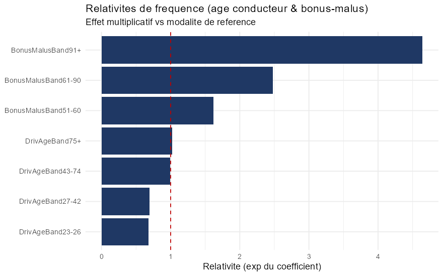
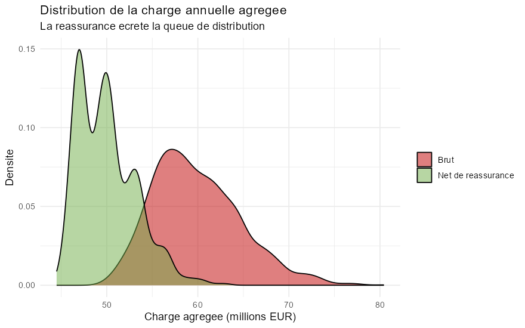

# Tarification automobile non-vie en R

[](https://www.r-project.org/)
[](rapport/rapport.md)
[](LICENSE)

Projet actuariel reproductible consacré à la tarification automobile. Le cœur de l’étude utilise les jeux de données publics `freMTPL2freq` et `freMTPL2sev` pour construire une approche fréquence–sévérité, analyser les sinistres graves et calculer des primes pures segmentées.

Le dépôt contient aussi deux extensions pédagogiques clairement séparées du portefeuille `freMTPL2` :

- un exemple de provisionnement Chain-Ladder/Mack sur le triangle `GenIns` du package `ChainLadder` ;
- une simulation simplifiée de réassurance Excess-of-Loss et de réduction d’un proxy de capital fondé sur la VaR à 99,5 %.

> **English summary:** Reproducible R project for French motor insurance pricing using `freMTPL2`, with separate educational examples for claims reserving and excess-of-loss risk-capital simulation.

## Périmètre et données

| Bloc | Données | Rôle dans le projet |
|---|---|---|
| Tarification | `freMTPL2freq` — 677 991 polices | Fréquence, segmentation et prime pure |
| Sévérité | `freMTPL2sev` — 26 444 sinistres | Coût moyen et valeurs extrêmes |
| Provisionnement | `GenIns` — exemple distinct | Illustration Chain-Ladder et Mack |
| Réassurance | Simulation à partir des sévérités empiriques | Comparaison de la charge brute et nette |

Les données sont distribuées par le package R [`CASdatasets`](https://cas.uqam.ca/) et ne sont pas incluses dans le dépôt.

## Méthodes

- **Fréquence :** Poisson, binomiale négative, surdispersion et test du Khi-deux.
- **Sévérité :** Gamma, lognormale, diagnostics d’adéquation et analyse de queue par Pareto/Hill.
- **Tarification :** GLM Poisson avec exposition, GLM Gamma et relativités tarifaires.
- **Provisionnement illustratif :** Chain-Ladder déterministe et incertitude de Mack.
- **Réassurance illustrative :** traité Excess-of-Loss, simulation agrégée et proxy `VaR(99,5 %) − moyenne`.

## Résultats reproduits

| Étape | Résultat |
|---|---|
| Fréquence | Surdispersion `V/E = 1,08`; la binomiale négative améliore l’AIC par rapport à Poisson |
| Queue de sévérité | Estimateur de Hill `α ≈ 1,17`, à interpréter comme un diagnostic sensible au seuil |
| Prime pure GLM | Écart agrégé inférieur à `0,2 %` par rapport au burning cost, sur les données d’ajustement |
| Scénario de prime commerciale | Ratio combiné illustratif d’environ `96 %` sous les hypothèses de chargement retenues |
| Exemple de provisionnement | Coefficient de variation de Mack d’environ `13 %` sur `GenIns` |
| Simulation XS | Réduction d’environ `25 %` du proxy de capital dans le scénario simulé |

Ces résultats décrivent l’exécution actuelle du projet. Ils ne constituent ni une validation hors échantillon, ni une étude réglementaire Solvabilité II, ni une recommandation de tarification.





## Documentation

- [Rapport détaillé](rapport/rapport.md)
- [Pipeline complet](R/run_all.R)
- [Tables générées](output/tables)
- [Figures générées](output/figures)

## Reproduire l’analyse

Prérequis : R 4.5 ou version compatible.

```r
install.packages("renv")
renv::restore()
```

Puis, depuis la racine du dépôt :

```bash
Rscript R/run_all.R
Rscript R/render_report.R
```

Les figures et tables sont régénérées dans `output/`. Le fichier `renv.lock` fixe les versions R et des packages utilisées pour la vérification.

## Structure

```text
R/                  scripts numérotés et pipeline complet
rapport/            rapport source R Markdown et rendu Markdown
output/figures/     graphiques générés
output/tables/      résultats tabulaires générés
```

## Limites

- Les performances tarifaires ne sont pas évaluées sur un jeu de test temporel ou externe.
- Le seuil de sinistres graves et l’estimation de Hill demandent une analyse de sensibilité plus complète.
- Les chargements commerciaux sont des hypothèses pédagogiques, pas des paramètres observés chez un assureur.
- `GenIns` n’est pas le triangle de développement du portefeuille `freMTPL2`.
- Le proxy de capital n’est pas un SCR réglementaire et omet notamment dépendances, primes de réassurance, risque de défaut et diversification.

## Auteur et licence

Projet réalisé par [Amine Manai](https://github.com/aminemanai2003), étudiant en M1 Actuariat à Le Mans Université et en double diplôme avec le cursus d’ingénierie Data Science d’ESPRIT.

Code distribué sous [licence MIT](LICENSE). Les jeux de données restent soumis aux conditions de leurs fournisseurs respectifs.
