> **Données de tarification :** `freMTPL2freq` + `freMTPL2sev` (package R
> `CASdatasets`) — portefeuille de responsabilité civile automobile française,
> **677 991 polices** et **26 444 sinistres**.
> **Outils :** R (`data.table`, `glm`, `MASS`, `fitdistrplus`, `actuar`, `ChainLadder`).

---

## 1. Objectif et démarche

Ce projet étudie une chaîne de tarification non-vie, de la préparation des
données au calcul d'une prime commerciale illustrative :

**Données → Fréquence → Coût → Prime pure → Prime commerciale.**

Deux extensions pédagogiques complètent l'analyse : le provisionnement utilise
le triangle public `GenIns`, distinct de `freMTPL2`, et la réassurance repose
sur une simulation simplifiée de charge agrégée. Elles ne forment donc pas une
chaîne métier intégrée sur un portefeuille unique.

## 2. Préparation et exploration des données

La base contrats et la base sinistres sont rapprochées par `IDpol`, puis
fiabilisées (plafonnement de l'exposition à 1 an, traitement des valeurs
aberrantes). On discrétise ensuite les variables continues (âge, ancienneté
du véhicule, bonus-malus, densité) pour la tarification.

**Indicateurs techniques du portefeuille :**

|Indicateur                 |Valeur     |
|:--------------------------|:----------|
|Exposition (annees-risque) |358 343    |
|Nombre de sinistres        |26 405     |
|Charge totale (EUR)        |59 909 216 |
|Frequence (sin/an)         |0.0737     |
|Cout moyen (EUR)           |2 268.9    |
|Prime pure empirique (EUR) |167.18     |

L'analyse univariée identifie les variables discriminantes en croisant
chaque facteur avec la fréquence (rapport sinistres / années-risque) :

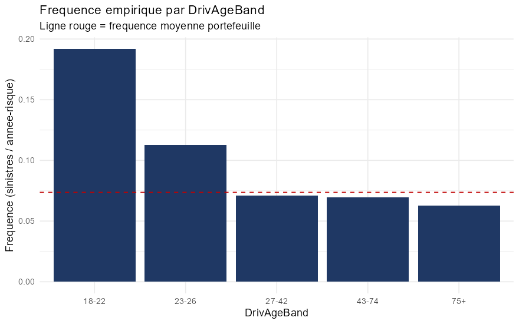

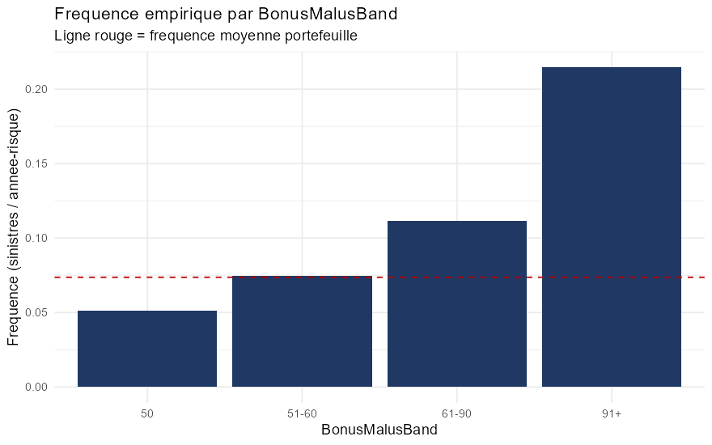

La fréquence décroît fortement avec l'expérience du conducteur et augmente
massivement avec le malus : ce sont des facteurs tarifaires majeurs. Les
tests de liaison (Kruskal-Wallis) confirment la significativité des liens.

## 3. Modélisation de la fréquence

On ajuste deux lois de comptage à la distribution du nombre de sinistres
par contrat, puis on les valide par le **test du Khi-deux**.

- Moyenne empirique $E(N) = 0.0389$,
  variance $V(N) = 0.042$.
- **Surdispersion** : $V(N)/E(N) = 1.079 > 1$.
  La loi de Poisson (qui impose $V(N)=E(N)$) est donc théoriquement mal
  adaptée ; la **binomiale négative** est préférable au regard de ces
  remarque du cours.

| NbSinistres| Observe| Theo_Poisson| Theo_BinomNeg|
|-----------:|-------:|------------:|-------------:|
|           0|  653047|       652094|        653047|
|           1|   23571|        25396|         23572|
|           2|    1298|          495|          1288|
|           3|      62|            6|            78|
|           4|      13|            0|             5|

|Loi                | D_khi2| ddl| seuil_5pct|    AIC|Decision                       |
|:------------------|------:|---:|----------:|------:|:------------------------------|
|Poisson            | 2162.0|   2|       5.99| 226315|Rejet de H0 (loi non adequate) |
|Binomiale Negative |   14.4|   2|       5.99| 225014|Rejet de H0 (loi non adequate) |

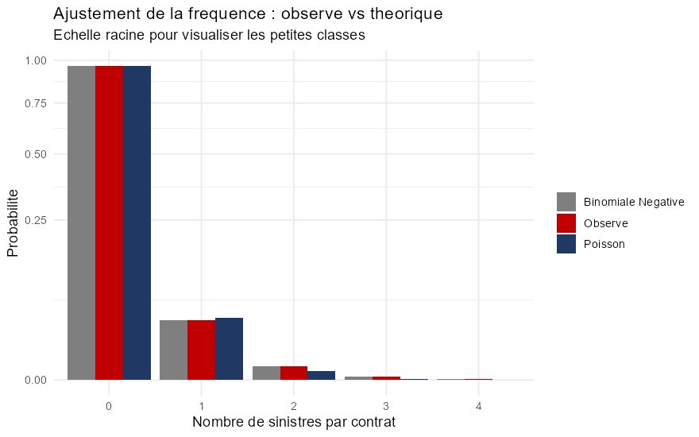

Les deux lois sont formellement rejetées par le Khi-deux, mais c'est un
artefact de la **très grande taille d'échantillon** ($n \approx 678\,000$) :
le moindre écart devient significatif. On s'appuie alors sur l'AIC et
l'ajustement graphique, qui montrent que la **binomiale négative domine
nettement** la loi de Poisson (statistique du Khi-deux divisée par ~150).

## 4. Modélisation du coût des sinistres

On distingue les sinistres **attritionnels** (fréquents, peu coûteux) des
sinistres **graves** (rares, très coûteux), avec un seuil à
**10 000 EUR**.

### 4.1 Attritionnels : lois Gamma et Lognormale

Validation par le **test de Kolmogorov-Smirnov** (loi continue) :

|Loi        |    AIC|   KS_D| KS_pvalue|
|:----------|------:|------:|---------:|
|Gamma      | 423669| 0.2310|         0|
|Lognormale | 427406| 0.2567|         0|

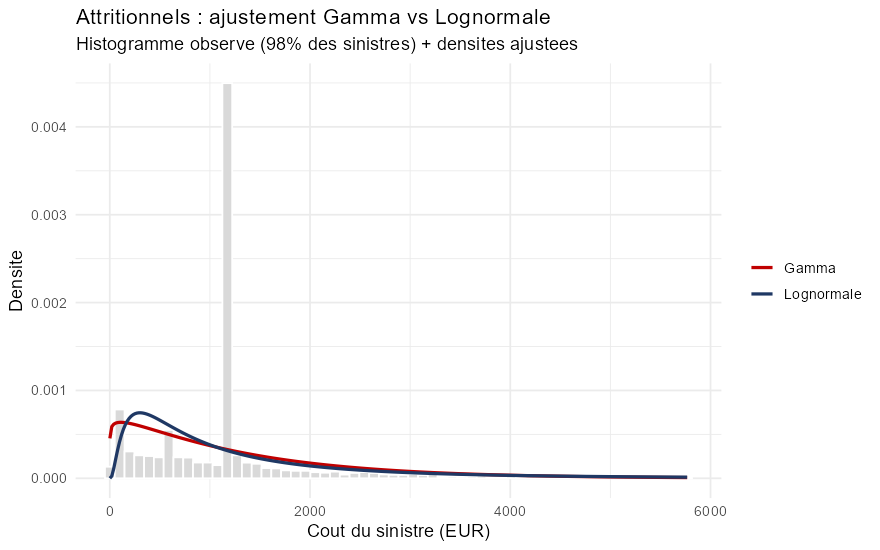

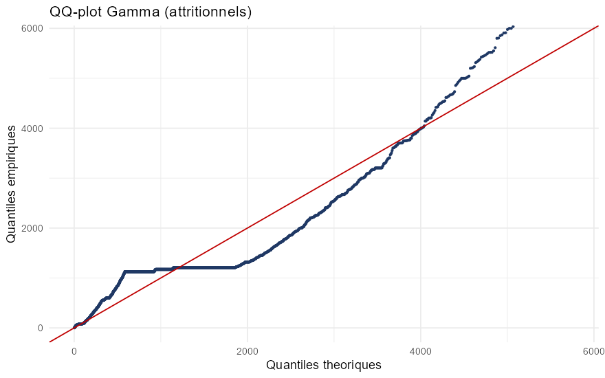

La loi **Gamma** est retenue (meilleur AIC). Comme pour la
fréquence, le KS rejette formellement l'adéquation parfaite (taille
d'échantillon), mais la loi capture bien la forme de la distribution.

### 4.2 Graves : théorie des valeurs extrêmes

Au-delà du seuil, le coût est modélisé par une **loi de Pareto**. L'indice
de queue est estimé par l'**estimateur de Hill** :
$\hat{\alpha} = 1.173$.

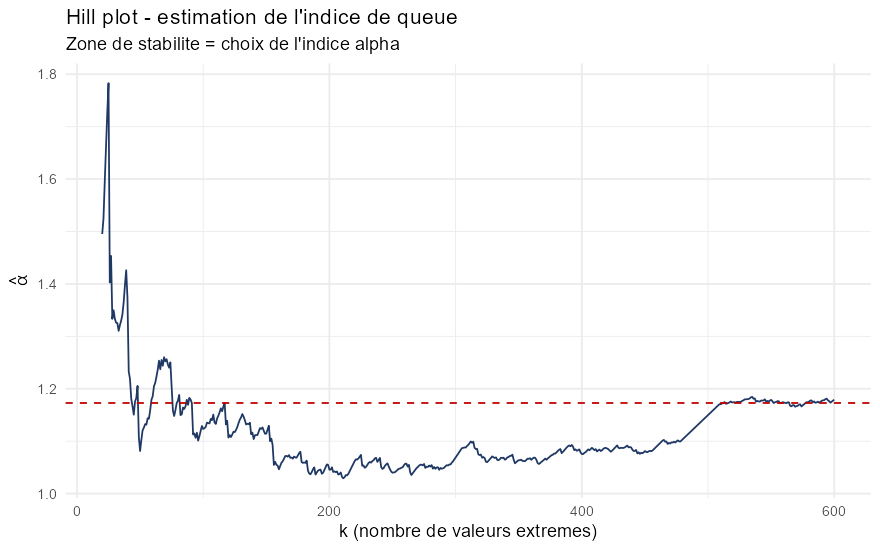

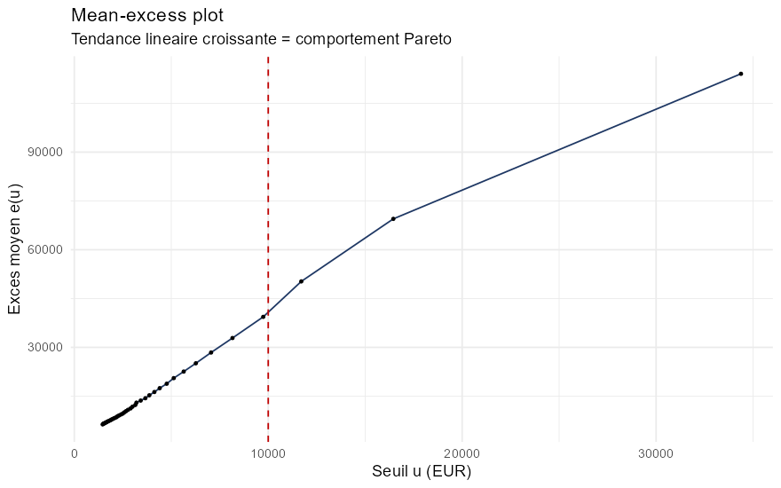

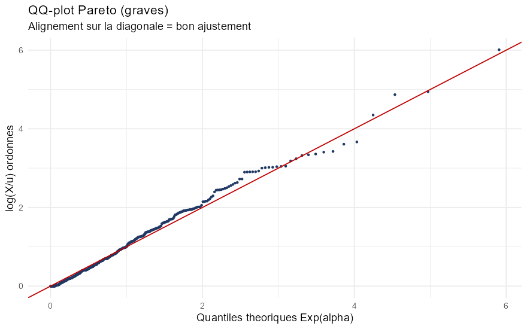

Avec $\hat{\alpha} \approx 1.17$, l'ajustement indique
une queue très épaisse au seuil retenu. Cette estimation est sensible au choix
du seuil et doit être lue comme un diagnostic exploratoire, pas comme une
caractérisation structurelle définitive du portefeuille.

## 5. Prime pure par GLM

La prime pure est modélisée selon l'approche **fréquence x coût moyen** :

- **GLM Poisson** (lien log, offset $\log(\text{Exposure})$) pour la fréquence ;
- **GLM Gamma** (lien log) pour le coût moyen des attritionnels ;
- chargement forfaitaire pour les graves.

$$
\text{Prime Pure}(x) = \underbrace{\text{fréquence}(x)}_{\text{GLM Poisson}}
\times \Big[(1-p_g)\,\underbrace{\text{coût attritionnel}(x)}_{\text{GLM Gamma}}
+ p_g\, E[\text{grave}]\Big]
$$

**Contrôle de calibration agrégée sur les données d'ajustement** :

|Indicateur                          |Valeur |
|:-----------------------------------|:------|
|Prime pure moyenne (modele GLM)     |166.98 |
|Prime pure empirique (burning cost) |167.18 |
|Ecart relatif                       |-0.1%  |

L'écart est inférieur à 0,2 % entre la prime pure moyenne et le burning cost
observé sur l'échantillon utilisé pour ajuster le modèle. Ce contrôle ne
remplace pas une validation hors échantillon ou temporelle. Les relativités
tarifaires décrivent l'effet multiplicatif estimé de chaque modalité :

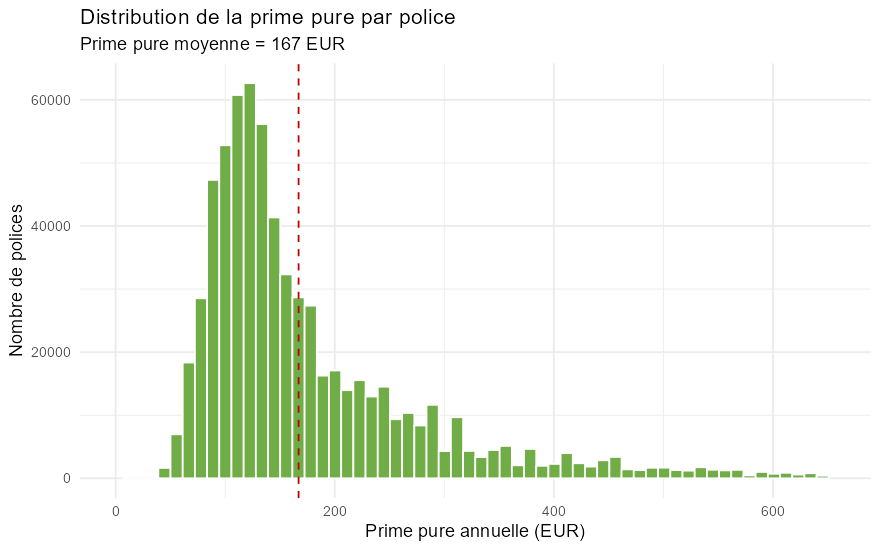

## 6. De la prime pure à la prime commerciale

On applique la formule du cours
$PC = PP\,(1+\alpha)/(1-\tau)$ avec un chargement de frais
$\tau = 20\%$ et un chargement de sécurité
$\alpha = 5\%$, puis les taxes.

|Indicateur                         |Valeur   |
|:----------------------------------|:--------|
|Primes pures acquises (EUR)        |59836744 |
|Primes commerciales acquises (EUR) |78535727 |
|Charge sinistres (EUR)             |59909216 |
|Ratio S/P                          |76.3%    |
|Ratio combine                      |96.3%    |
|Marge technique attendue           |3.7%     |

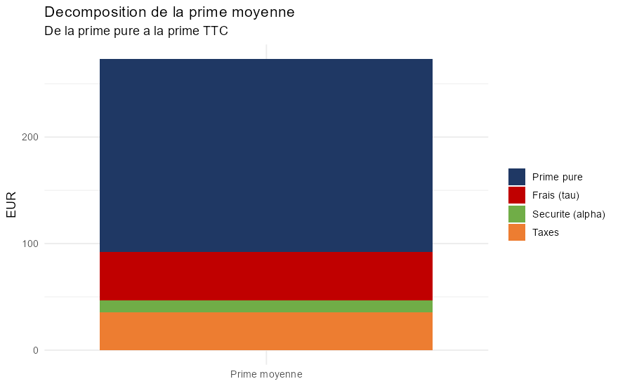

Le ratio combiné obtenu est inférieur à 100 % dans ce **scénario de
chargements supposés**. Il s'agit d'une illustration, pas d'une observation
de rentabilité d'un assureur. Exemples de tarifs par profil :

|Profil                                        |   Freq| PrimePure| PrimeCommerciale| PrimeTTC|
|:---------------------------------------------|------:|---------:|----------------:|--------:|
|Jeune conducteur, vehicule puissant, ville    | 0.3207|     769.9|           1010.5|   1162.1|
|Conducteur experimente, vehicule moyen, rural | 0.0574|     125.8|            165.1|    189.9|
|Senior, petite cylindree, peripherie          | 0.0954|     219.8|            288.5|    331.8|

Un jeune conducteur sur véhicule puissant en ville paie plusieurs fois la
prime d'un conducteur expérimenté sur petit véhicule : la segmentation
**lutte contre l'antisélection**.

## 7. Provisionnement (Chain-Ladder + Mack)

Le jeu freMTPL2 ne contient pas de dimension de déroulement ; on illustre
donc le provisionnement sur le triangle public **`GenIns`**, fourni par le
package `ChainLadder`. Cet exemple est indépendant du portefeuille de
tarification et ses montants ne doivent pas être rapprochés de `freMTPL2`.

| Annee_origine| Paye_a_ce_jour| Charge_ultime| Provision_CL|
|-------------:|--------------:|-------------:|------------:|
|             1|           3901|          3901|            0|
|             2|           5339|          5434|           95|
|             3|           4909|          5379|          470|
|             4|           4588|          5298|          710|
|             5|           3873|          4858|          985|
|             6|           3692|          5111|         1419|
|             7|           3483|          5661|         2178|
|             8|           2864|          6785|         3920|
|             9|           1363|          5642|         4279|
|            10|            344|          4970|         4626|

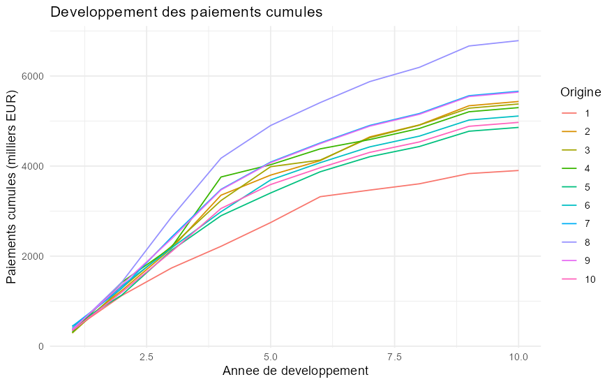

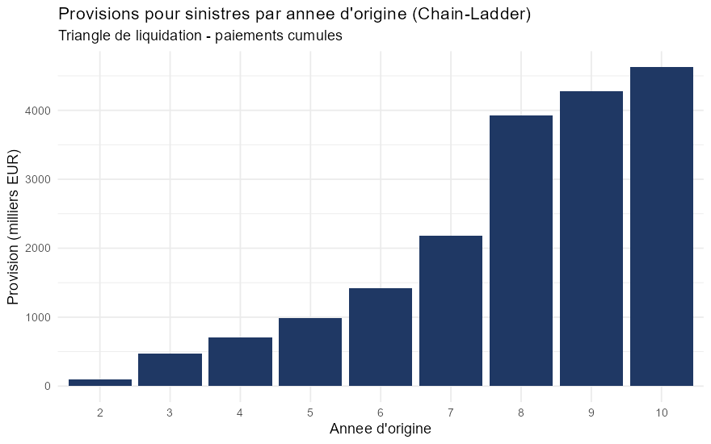

- **Provision Chain-Ladder totale** : 18 681 milliers EUR.
- **Modèle de Mack** : erreur de prédiction (Mack S.E.) avec un
  coefficient de variation de **13.1 %**, qui quantifie
  l'incertitude autour de la provision dans cet exemple illustratif.

## 8. Réassurance Excess-of-Loss et proxy de capital

On met en place un traité **XS** : priorité
50 000 EUR, portée
1 000 000 EUR.

|Indicateur                       |Valeur     |
|:--------------------------------|:----------|
|Priorite (retention)             |50 000     |
|Portee                           |1 000 000  |
|Charge brute (EUR)               |59 909 216 |
|Charge retenue (EUR)             |50 021 518 |
|Charge cedee au reassureur (EUR) |9 887 699  |
|Taux de cession                  |16.50%     |
|Nb sinistres touchant le traite  |88         |
|Sinistre max brut (EUR)          |4 075 401  |
|Sinistre max retenu (EUR)        |3 075 401  |

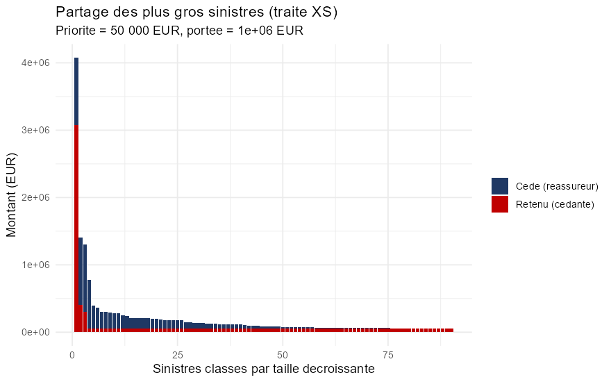

Par simulation de la charge annuelle agrégée (modèle collectif simplifié), on
compare la moyenne, la volatilité, la VaR à 99,5 % et le proxy
`VaR(99,5 %) − moyenne` avant et après réassurance :

|Mesure                               |     Brut| Net_de_reassurance|Reduction |
|:------------------------------------|--------:|------------------:|:---------|
|Charge moyenne (EUR)                 | 59877076|           50007396|16.5%     |
|Ecart-type (EUR)                     |  4803827|            3173911|33.9%     |
|VaR 99,5% (EUR)                      | 74045892|           60616359|18.1%     |
|Proxy de capital (VaR99,5 - moyenne) | 14168816|           10608963|25.1%     |

Dans la simulation, le traité cède **16.5 %** de
la charge et réduit le proxy de capital de
**25.1 %**. Ce proxy n'est pas un SCR
réglementaire : il omet notamment les primes de
réassurance, le risque de défaut, les dépendances et la diversification.

## 9. Conclusion

Ce projet met en œuvre une étude de tarification sur des données publiques,
complétée par deux exemples pédagogiques distincts :

| Étape | Méthode | Résultat clé |
|---|---|---|
| Fréquence | Poisson / binomiale négative + Khi-deux | surdispersion, BN retenue |
| Coût attritionnel | Gamma / Lognormale + KS | Gamma retenue |
| Coût grave | Pareto / Hill (EVT) | $\alpha = 1.17$ |
| Prime pure | GLM fréquence × coût | écart agrégé < 0,2 % sur l'ajustement |
| Prime commerciale | chargements supposés + taxes | ratio combiné illustratif ~96 % |
| Provisionnement | Chain-Ladder + Mack sur `GenIns` | CoV 13.1 % |
| Réassurance | traité XS simulé | proxy de capital -25 % |

**Limites et pistes** : validation temporelle ou externe des modèles,
sensibilité au seuil de sinistres graves, modèles GAM/GBM pour les
non-linéarités, modèle Tweedie en une étape, bootstrap ODP et crédibilité pour
les segments à faible exposition. Les chargements commerciaux sont supposés,
`GenIns` est un jeu distinct et le proxy de capital n'a pas de portée
réglementaire.
